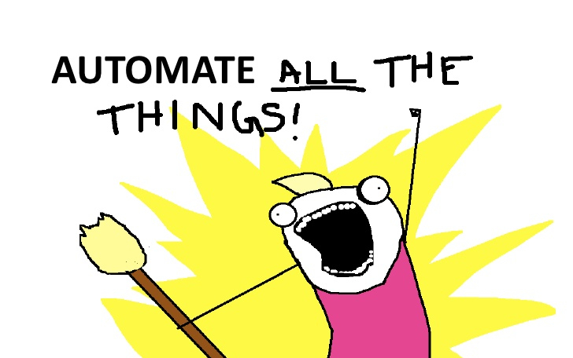

# Praktische afspraken

## Lectoren

- Thomas Parmentier
- Andy Van Maele
- Bert Van Vreckem

## Studiemethode (MT2)

- 3 lesuur / week
- 4 studiepunten
- equivalente hoeveelheid voor- en nawerk thuis

## Studiemethode (MT3)

- 2 lesuur / week
- 3 studiepunten
- equivalente hoeveelheid voor- en nawerk thuis

## Linux flavour

- Debian or Red Hat?
- Linux Mint als GUI-Linux VM
    - Download ova file
    - import & get started

# Intro

## Waarom Linux?

## Linux is overal

... en je kan er gewoon niet meer omheen

- Grootste websites
    - webapps draaien meestal op Linux
    - ook .Net (meer en meer)!
- MacOS X
    - Ook UNIX (BSD)
    - Bash-shell + commando's

---

- Moderne tools voor software release management
    - Continuous Integration/Delivery
    - Docker
- Embedded systemen
    - Arduino, Raspberry Pi, ...
    - Multimedia-apparatuur, TV's,  NAS, ...

---

---

- Toolbox voor automatisering
    - Filtercommando's
    - `grep`/`ag`, `sed`, `awk`
    - `curl`, `jq`, `pandoc`, ...
    - Shell scripts
    - Configuration Management Systems (Ansible, ...)

## Ook in de Windows-wereld

- Azure cloud platform draait >50% Linux VMs
- Microsoft loves Linux!

---

> The '70's called, they want their terminal back!

## De kracht van de CLI

- Command line interface (CLI) is de sleutel tot **automatisering**
    - Miljoenen servers beheren gaat niet via GUI
    - Ook in Windows ziet men dit nu in (PowerShell)
- CLI Instructies zijn **bondiger** en makkelijker reproduceerbaar dan GUI instructies

## Verloop contactmoment

- Klassikale instructie
- Werken aan labo-oefeningen
    - individuele feedback
    - extra klassikale uitleg
- Korte intro volgende sessie

## Buiten contactmomenten

- Bereid volgende sessie voor
    - Leerpad: voorbereiding, achtergrondinfo, oefeningen met oplossingen
- Werk verder aan labo's

## Tips voor slagen

- Kom naar de les!
- Lees de studiewijzer!
- Maak de labo's!
