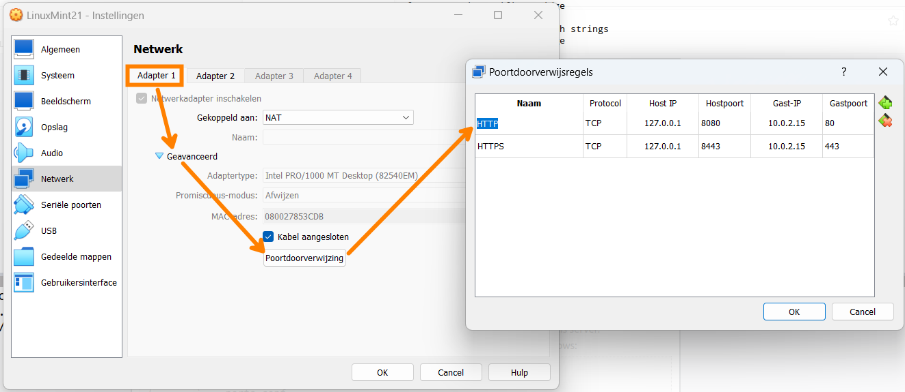

# Webserver installatie

## Doelstelling

- LAMP-stack: **L**inux + **A**pache + **M**ariaDB + **P**HP
- Website bekijken in de browser

## Installatie software

```bash
$ sudo apt install apache2 libapache2-mod-php mariadb-server php php-mysql
```

## Belangrijke directories

- `/etc/apache2/`: configuratie Apache
    - `/etc/apache2/apache2.conf`
    - `/etc/apache2/conf-enabled/*.conf`
    - `/etc/apache2/mods-enabled/*.conf`
    - `/etc/apache2/sites-enabled/*.conf`
- `/var/www/html/`: Apache DocumentRoot
- `/var/log/apache2/`: logbestanden
    - `access.log`
    - `error.log`

## Services beheren

- Bij installatie worden services automatisch opgestart
- Na rebooten eveneens
- Controleer!
    - `systemctl status mariadb`
    - `systemctl status apache2`
    - `ss -tlnp`

## Het commando systemctl

Info opvragen: geen `sudo` nodig

```console
$ systemctl status <service>
$ systemctl is-enabled <service>
$ systemctl is-active <service>
$ systemctl list-units --type=service
$ systemctl list-units --failed
```

---

Toestanden wijzigen: `sudo` vereist!

```console
$ sudo systemctl start <service>
$ sudo systemctl stop <service>
$ sudo systemctl restart <service>
$ sudo systemctl enable <service>
$ sudo systemctl disable <service>
```

## Het commando ss

ss = Show Sockets

| Task                 | Command                |
| :---                 | :---                   |
| Show server sockets  | `ss -l`, `--listening` |
| Show TCP sockets     | `ss -t`, `--tcp`       |
| Show UDP sockets     | `ss -u`, `--udp`       |
| Show port numbers(*) | `ss -n`, `--numeric`   |
| Show process(†)      | `ss -p`, `--processes` |

(*) instead of service names from `/etc/services`

(†) *root permissions* required

## Voorbeeld

```console
linuxmint@linuxmint21:~$ sudo ss -tlnp
State   Recv-Q  Send-Q  Local Address:Port  Peer Address:Port  Process
LISTEN  0       80          127.0.0.1:3306       0.0.0.0:*      users:(("mariadbd",pid=45957,fd=20))
LISTEN  0       128           0.0.0.0:22         0.0.0.0:*      users:(("sshd",pid=850,fd=3))
LISTEN  0       511                 *:80               *:*      users:(("apache2",pid=52633,fd=4),[...])
LISTEN  0       128              [::]:22            [::]:*      users:(("sshd",pid=850,fd=4)) 
```

## Test de services

- CLI webbrowser *op de VM*

    - surf naar <http://localhost/>

    ```bash
    curl localhost
    curl 127.0.0.1
    ```

- PHP testen: maak bestand `/var/www/html/info.php`

    ```php
    <?php phpinfo(); ?>
    ```

- Surf naar: <http://localhost/info.php>

## Ondersteuning voor HTTPS

- "Module" `ssl`
- Zie `/etc/apache2/`
    - `mods-available`, `mods-enabled`
    - `conf-available`, `conf-enabled`

```console
hogent@LinuxGUI:/var/www/html$ sudo a2ensite default-ssl
Enabling site default-ssl.
To activate the new configuration, you need to run:
  systemctl reload apache2
hogent@LinuxGUI:~$ sudo a2enmod ssl
Considering dependency mime for ssl:
Module mime already enabled
Considering dependency socache_shmcb for ssl:
Module socache_shmcb already enabled
Enabling module ssl.
See /usr/share/doc/apache2/README.Debian.gz on how to configure SSL and create self-signed certificates.
To activate the new configuration, you need to run:
  systemctl restart apache2
hogent@LinuxGUI:~$ sudo systemctl restart apache2.service 
```

Controleer open poorten met `ss` en open de pagina met https!

## Logbestanden

Voorbeeld voor Apache:

```console
$ sudo journalctl
$ sudo journalctl -u apache2
$ sudo journalctl -flu apache2
$ sudo tail -f /var/log/apache2/access_log
$ sudo tail -f /var/log/apache2/error_log
```

## `journalctl`

- `journalctl` vereist *root*-permissies
    - Of voeg gebruiker toe aan groep `adm` of `systemd-journal`
- Andere logbestanden:
    - `/var/log/syslog` (hoofd-logbestand)
    - `/var/log/dmesg` (log bootproces)
    - ...


## Opties

| Actie                               | Commando                                  |
| :---------------------------------- | :---------------------------------------- |
| Toon laatste lijnen en wacht        | `journalctl -f`, `--follow`               |
| Toon enkel log van SERVICE          | `journalctl -u SERVICE`, `--unit=SERVICE` |
| Log voor executable, bv. `dhclient` | `journalctl /usr/sbin/dhclient`           |
| Log voor apparaat, bv. `/dev/sda`   | `journalctl /dev/sda`                     |
| Toon auditd logs                    | `journalctl _TRANSPORT=audit`             |

---

| Actie                               | Commando                              |
| :---------------------------------- | :------------------------------------ |
| Toon log sinds laatste boot         | `journalctl -b`, `--boot`             |
| Kernelberichten (zoals `dmesg`)     | `journalctl -k`, `--dmesg`            |
| Omgekeerde uitvoer (nieuwste eerst) | `journalctl -r`, `--reverse`          |
| Toon alleen fouten en erger         | `journalctl -p err`, `--priority=err` |
| Sinds gisteren                      | `journalctl --since=yesterday`        |

---

Filter op tijd (voorbeeld):

```console
journalctl --since=2018-06-00 \
           --until="2018-06-07 12:00:00"
```

Veel meer opties in de man-pagina!

## Website vanaf fysiek systeem bekijken

- Controleer IP-adres VM: `ip a`
    - VBox NAT-interface: 10.0.2.15
- Stel port forwarding regels in
- Open webbrowser *op fysiek systeem*
    - surf naar <http://127.0.0.1:8080/info.php>

---



## Database testen: root

```bash
$ sudo mysql mysql
...
MariaDB [mysql]> SHOW DATABASES;
MariaDB [mysql]> SELECT user,password from user;
MariaDB [mysql]> quit
```

- `sudo` => inloggen als MariaDB-root

    - wachtwoord uitgeschakeld
    - kan enkel vanaf localhost met `sudo`

- 2e `mysql`: inloggen op database `mysql`

## Labo-oefening

Ga nu zelf verder met de labo-oefening! Leerpad 4.4.1
