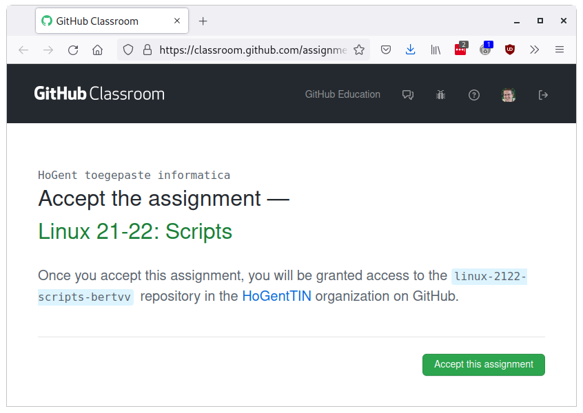
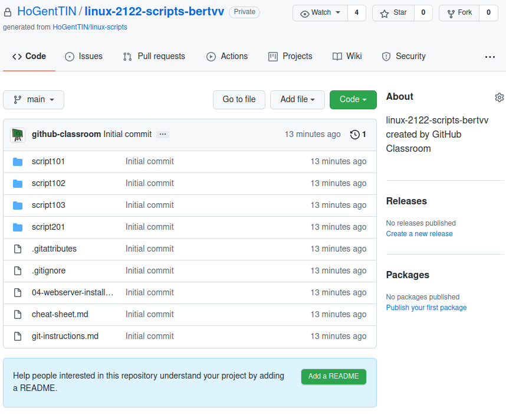

# Webserver installatie

## Doelstelling

- LAMP-stack: **L**inux + **A**pache + **M**ariaDB + **P**HP
- Website bekijken vanop de andere VM (Linux Mint)

## Installatie software

```bash
$ sudo dnf install httpd mariadb-server php
```

## Belangrijke directories

- `/etc/httpd/`: configuratie Apache
    - `/etc/httpd/conf/httpd.conf`
    - `/etc/httpd/conf.d/*.conf`
- `/var/www/html/`: Apache DocumentRoot
- `/var/log/httpd/`: logbestanden
    - `access_log`
    - `error_log`

## Services opstarten

```bash
$ sudo systemctl start mariadb
$ sudo systemctl enable mariadb
$ sudo systemctl start httpd
$ sudo systemctl enable httpd
```

- `start`: *nu* opstarten
- `enable`: automatisch opstarten bij *booten*

## Test de services

```bash
$ systemctl status httpd
$ systemctl status mariadb
```

- CLI webbrowser *op de VM*
    - surf naar <http://localhost/>
```bash
curl localhost
curl 127.0.0.1
```

- PHP testen: maak bestand
  `/var/www/html/info.php`
- Surf naar: <http://localhost/info.php>

```php
<?php phpinfo(); ?>
```

## Toon sockets/poorten in gebruik

Show sockets: `ss`

- `netstat` is obsolete, replaced by `ss`
    - `netstat` uses `/proc/net/tcp`
    - `ss` directly queries the kernel
- Similar options

## ss Options

| Task                 | Command                |
| :---                 | :---                   |
| Show server sockets  | `ss -l`, `--listening` |
| Show TCP sockets     | `ss -t`, `--tcp`       |
| Show UDP sockets     | `ss -u`, `--udp`       |
| Show port numbers(*) | `ss -n`, `--numeric`   |
| Show process(†)      | `ss -p`, `--processes` |

(*) instead of service names from `/etc/services`

(†) *root permissions* required

## Example

```console
$ sudo ss -tlnp
State   Recv-Q Send-Q Local Address:Port Peer Address:Port
LISTEN  0      128                *:22              *:*    users:(("sshd",pid=1290,fd=3))
LISTEN  0      100        127.0.0.1:25              *:*    users:(("master",pid=1685,fd=13))
LISTEN  0      128               :::80             :::*    users:(("httpd",pid=4403,fd=4),("httpd",pid=4402,fd=4),("httpd",pid=4401,fd=4),("httpd",pid=4400,fd=4),("httpd",pid=4399,fd=4),("httpd",pid=4397,fd=4))
LISTEN  0      128               :::22             :::*    users:(("sshd",pid=1290,fd=4))
LISTEN  0      100              ::1:25             :::*    users:(("master",pid=1685,fd=14))
LISTEN  0      128               :::443            :::*    users:(("httpd",pid=4403,fd=6),("httpd",pid=4402,fd=6),("httpd",pid=4401,fd=6),("httpd",pid=4400,fd=6),("httpd",pid=4399,fd=6),("httpd",pid=4397,fd=6))
```

## Logbestanden

Voorbeeld voor Apache:

```console
$ sudo journalctl
$ sudo journalctl -u httpd
$ sudo journalctl -flu httpd
$ sudo tail -f /var/log/httpd/access_log
$ sudo tail -f /var/log/httpd/error_log
```

## `journalctl`

- `journalctl` requires *root permissions*
    - Or, add user to group `adm` or `systemd-journal`
- Some "traditional" text-based log files still exist (for now?):
    - `/var/log/messages` (gone in Fedora!)
    - `/var/log/httpd/access_log` and `error_log`
    - ...

## Options

| Action                               | Command                                   |
| :---                                 | :---                                      |
| Show latest log and wait for changes | `journalctl -f`, `--follow`               |
| Show only log of SERVICE             | `journalctl -u SERVICE`, `--unit=SERVICE` |
| Match executable, e.g. `dhclient`    | `journalctl /usr/sbin/dhclient`           |
| Match device node, e.g. `/dev/sda`   | `journalctl /dev/sda`                     |
| Show auditd logs                     | `journalctl _TRANSPORT=audit`             |

---

| Action                         | Command                               |
| :---                           | :---                                  |
| Show log since last boot       | `journalctl -b`, `--boot`             |
| Kernel messages (like `dmesg`) | `journalctl -k`, `--dmesg`            |
| Reverse output (newest first)  | `journalctl -r`, `--reverse`          |
| Show only errors and worse     | `journalctl -p err`, `--priority=err` |
| Since yesterday                | `journalctl --since=yesterday`        |

---

Filter on time (example):

```console
journalctl --since=2018-06-00 \
           --until="2018-06-07 12:00:00"
```

Much more options in the man-page!

## Website vanaf GUI Linux VM bekijken

- Controleer IP-adres VM: `ip a`
    - waarschijnlijk 192.168.76.2
		- verifieer dat je GUI Linux VM een IP-adres in dit netwerk heeft
		- ping ?!
- Open webbrowser *op fysiek systeem*
    - surf naar <http://192.168.76.2/>

## Database beveiligen

```bash
$ sudo mysql_secure_installation
```

- Volg de instructies!
- kies MariaDB root-wachtwoord
    - ≠ wachtwoord Linux root!
- bevestig andere vragen (ENTER)

**Hou je wachtwoorden goed bij!**

## Database testen: root

```bash
$ mysql -uroot -pR2rrbLV02TA1hAjN mysql
...
MariaDB [mysql]> SHOW DATABASES;
MariaDB [mysql]> SELECT user,password from user;
MariaDB [mysql]> quit
```

- `-uroot`: inloggen als MariaDB-root
- `-pR2rrbLV02TA1hAjN`: gekozen wachtwoord
    - (GEEN spatie na `-p`)
- `mysql`: inloggen op database `mysql`


# Scripting (vervolg)

## Positionele parameters

Bij uitvoeren van script zijn opties en argumenten beschikbaar via variabelen, *positionele parameters*

| Variabele           | Betekenis                                  |
|:--------------------|:-------------------------------------------|
| `${0}`              | Naam script                                |
| `${1}`, `${2}`, ... | Eerste, tweede, ... argument               |
| `${10}`             | Tiende argument (accolades verplicht!)     |
| `${*}`              | Alle argumenten: `${1} ${2} ${3}...`       |
| `${@}`              | Alle argumenten: `"${1}" "${2}" "${3}"...` |
| `${#}`              | Aantal positionele parameters              |

## Positionele parameters: shift

Het commando `shift` schuift positionele parameters op naar links:

- `${1}` verdwijnt
- `${2}` wordt `${1}`
- `${3}` wordt `${2}`
- enz.

## Positionele parameters instellen

```bash
set par1 par2 par3
echo "${1}"  #  => par1
echo "${2}"  #  => par2
echo "${3}"  #  => par3
echo "${4}"  #  =>       (lege string)
```

## Exit-status

- Elk commando heeft een *exit-status*, numerieke waarde
    - Opvragen met `echo "$?"`
    - 0 => commando geslaagd, logische *true*
    - 1-255 => commando gefaald, logische *false*
- Logische operatoren in Bash zijn gebaseerd op exit-status
- Booleaanse variabelen *bestaan niet*

## De commando's `true` en `false`

Er bestaan wel gelijknamige commando's.

In Java zou je `true` als volgt implementeren

```java
public class True {
  public static void main(String[] args) {
    System.exit(0);
  }
}
```

en `false`:

```java
public class False {
  public static void main(String[] args) {
    System.exit(1);
  }
}
```

## Logische operatoren

```bash
if COMMANDO; then
  # A
else
  # B
fi
```

- `A`-blok wordt uitgevoerd als exit-status van `COMMANDO` 0 is (geslaagd, TRUE)
- `B`-blok wordt uitgevoerd als exit-status van `COMMANDO` verschillend is van 0 (gefaald, FALSE)

## Operatoren `&&` en `||`

```bash
command1 && command2
```

`command2` wordt enkel uitgevoerd als `command1` succesvol was (exit 0)

```bash
command1 || command2
```

`command2` wordt enkel uitgevoerd als `command1` **niet** succesvol was (exit ≠ 0)

## Het commando `test`

- Evalueren van logische expressies
- Geeft geschikte exit-status
    - 0 = TRUE
    - 1 = FALSE
- Alias voor `test` is `[`
    - `[` is een *commando*, geen "haakje" in de traditionele betekenis
    - spaties vóór en na!

---

```bash
# Fout:
if[$#-eq 0]; then
  echo "Expected at least one argument"
fi

# Juist:
if [ "${#}" -eq "0" ]; then
  echo "Expected at least one argument"
fi
```

## If (1)

```bash
if EXPR
then
  # ...
elif EXPR
  # ...
else
  # ...
fi
```

## If (2)

```bash
if [ "${#}" -gt '2' ]; then
  printf 'Expected at most 2 arguments, got %d\n' "${#}" >&2
  exit 1
fi
```

## While-lus

```bash
while EXPR; do
  # ...
done
```

## Until-lus

```bash
until EXPR; do
  # ...
done
```

## While lus met teller

```bash
counter=0

while [ "${counter}" -le '10' ]; do
  echo "${counter}"
  counter=$((counter + 1))
done
```

`$(( ... ))` is *arithmetic expansion*

## For-lus

Itereren over een lijst

```bash
for ITEM in LIST; do
  # ...
done
```

```bash
for file in *.md; do
  printf 'Processing file %s\n' "${file}"
  # ...
done
```

## For-lus met teller (1/3)

```bash
for i in {1..10}; do
  echo "${i}"
done
```

```bash
for i in {2..20..2}; do
  echo "${i}"
done
```

## For-lus met teller (2/3)

```bash
for i in $(seq 1 10); do
  echo "${i}"
done
```

```bash
for i in $(seq 2 2 20); do
  echo "${i}"
done
```

## For-lus met teller (3/3)

"Klassieke" for-lus, komt slechts uitzonderlijk voor

```bash
for ((i=0; i<=10; i++)); do
  echo "${i}"
done
```

## Itereren over positionele parameters (`while`)

```bash
while [ "$#" -gt 0 ]; do
  printf 'Arg: %s\n' "${1}"
  # ...
  shift
done
```

## Itereren over positionele parameters (`for`)

```bash
for arg in "${@}"; do
  printf 'Arg: %s\n' "${arg}"
  # ...
done
```

# Opzetten werkomgeving

## Github-repo voor labo-taken aanmaken

Ga naar Chamilo, volg de link om een Github-repo aan te maken.

---



---


---

- Persoonlijke private Github-repository
- Uitnodiging voor Github-organisatie "HogentTIN"
    - <https://github.com/HoGentTIN>

---

<https://github.com/HoGentTIN/linux-2122-scripts-USERNAME>



## Configuratie Git

<div style="color: red;">**Volgende stappen voer je uit op de GUI VM (Linux Mint)**</div>

Git moet al geïnstalleerd zijn!
## Sleutelpaar genereren

```console
osboxes@osboxes:~$ ssh-keygen 
Generating public/private rsa key pair.
Enter file in which to save the key (/home/bert/.ssh/id_rsa): 
Created directory '/home/bert/.ssh'.
Enter passphrase (empty for no passphrase): 
Enter same passphrase again: 
Your identification has been saved in /home/bert/.ssh/id_rsa
Your public key has been saved in /home/bert/.ssh/id_rsa.pub
The key fingerprint is:
SHA256:S/WtkPaCSXWK/oqs9lywV6XnMf8nYmYMZ4Io1lx8fS4 bert@osboxes
The key's randomart image is:
+---[RSA 3072]----+
|                 |
|                 |
|       .  o.o    |
|        o+.B...  |
|     o.oSoB =o.  |
|    o +*.*o=E=.  |
|   . .. B .*+..  |
|    .o + . .* ...|
|   ..o= ...+ . .o|
+----[SHA256]-----+
```

## Publieke sleutel kopiëren

- Open `~/.ssh/id_rsa.pub` en kopieer de **volledige** inhoud
- Ga in een browser naar <https://github.com/> en meld aan
- Klik rechtsboven op je avatar, kies "Settings"
- Klik door op "SSH and GPG keys"
- Klik "New SSH key"

---


## Publieke sleutel registreren

Plak in het "Key" veld:


## Github repo klonen

Klik "Code", SSH, Kopieer de URL:


---

```console
osboxes@osboxes:~$ git clone git@github.com:HoGentTIN/linux-2122-scripts-bertvv.git
Cloning into 'linux-2122-scripts-bertvv'...
The authenticity of host 'github.com (140.82.121.4)' can't be established.
RSA key fingerprint is SHA256:nThbg6kXUpJWGl7E1IGOCspRomTxdCARLviKw6E5SY8.
Are you sure you want to continue connecting (yes/no/[fingerprint])? yes
Warning: Permanently added 'github.com,140.82.121.4' (RSA) to the list of known hosts.
remote: Enumerating objects: 28, done.
remote: Counting objects: 100% (28/28), done.
remote: Compressing objects: 100% (25/25), done.
remote: Total 28 (delta 1), reused 27 (delta 1), pack-reused 0
Receiving objects: 100% (28/28), 17.54 KiB | 8.77 MiB/s, done.
Resolving deltas: 100% (1/1), done.
```

## Basisconfiguratie Git

```console
osboxes@osboxes:~$ git config --global user.name "VOORNAAM NAAM"
osboxes@osboxes:~$ git config --global user.email "VOORNAAM.NAAM@student.hogent.be"
osboxes@osboxes:~$ git config --global push.default simple
```

## Werken met Git

- Je hebt nu een lokale kopie van de Github-repo:
    - `~/linux-2122-scripts-USERNAME`
- Maak wijzigingen (teksteditor)
- `git status`
- `git add .`
- `git commit -m "Beschrijving wijzigingen`
- `git push` 

## Oefening

Maak een bestand `README.md` met deze inhoud:

```markdown
# Linux scripting labo's

- Student: STUDENTNAAM
- Klasgroep: GROEPNAAM
```

Commit, push naar Github, bekijk het resultaat op github.com!

## Labo-oefeningen

- Start met oefeningenreeks `script102`

    ```console
    cd ~/linux-2122-scripts-USERNAME/script102
    ```

- Opgave: `script102-rapport.md` of Chamilo-leerpad
- Controleer je oplossingen met:

    ```console
    ./test/runtests.sh
    ```
