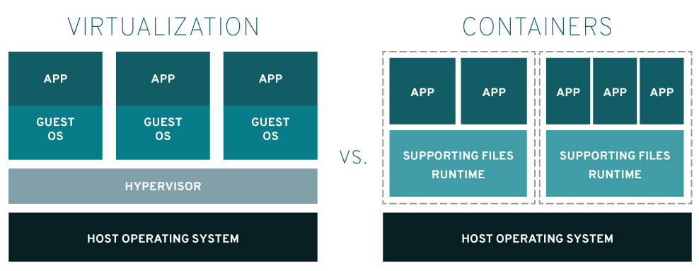

# Intro

## Containervirtualisatie



<https://www.redhat.com/en/topics/containers/containers-vs-vms>

## Containers zijn oud!

OS-level virtualization

- Mainframe
- Solaris Zones
- FreeBSD jails
- Linux Containers (LXC)
- ...

## En toen kwam Docker...

<iframe width="560" height="315" src="https://www.youtube.com/embed/wW9CAH9nSLs" title="The future of Linux Containers" frameborder="0" allow="accelerometer; autoplay; clipboard-write; encrypted-media; gyroscope; picture-in-picture" allowfullscreen></iframe>

Solomon Hykes @ PyCon 2013

## De belofte...

- Lichtgewicht VM => efficient gebruik van systeembronnen
- Encapsulation van applicatie als beveiliging
- Makkelijker uitrollen in productie

# Labo-omgeving opzetten

## Lokale labo-omgeving

- Ga naar het leerpad op Chamilo, 8.4 Labo-oefeningen
- Download het .zip-bestand en pak uit
    - Directory `dockerlab`
    - Op je fysieke systeem!
    - In lokale kopie van je Github-repo
- Installeer Vagrant
    - <https://developer.hashicorp.com/vagrant/downloads>
    - `choco install vagrant`, `brew install...`, etc

## Start de Docker-VM op

```console
$ cd dockerlab
$ vagrant status
Current machine states:

dockerlab                 not created (virtualbox)

$ vagrant up
```

## Op het einde van het labo:

```console
$ vagrant halt
```

| Taak                       | Commando          |
| :------------------------- | :---------------- |
| Overzicht Vagrant-omgeving | `vagrant status`  |
| VM aanmaken/Opstarten      | `vagrant up`      |
| VM Afsluiten               | `vagrant halt`    |
| Herstarten                 | `vagrant reload`  |
| Inloggen                   | `vagrant ssh`     |
| VM vernietigen             | `vagrant destroy` |

## Docker-VM

- Ubuntu 20.04 LTS
- 4GiB RAM
- Geïnstalleerde software:
    - Docker, Docker-compose
    - Portainer
    - Nuttige commando's
- Bash aliases

## Aan de slag!

- Open de labo-opdracht (dockerlab/assignment.md)
- Open een browsertabblad en surf naar <http://192.168.56.20:9000> (Portainer UI)
- Volg de stappen in de opgave!

# Belangrijke competenties

## Man-pages

```console
man docker-run
man docker-exec
man docker-<TAB><TAB>
```

## Images

```console
docker image ls
docker pull
```

## Containers

```console
docker run -d
docker run -i -t
docker exec -i -t
docker ps
docker container ls
```

## Volumes voor persistente data

```console
docker volume ls
docker volume create VOLUME_NAME
docker volume inspect VOLUME_NAME
docker volume rm VOLUME_NAME
docker volume prune
```

## Custom images

Voorbeeld Dockerfile:

```Dockerfile
FROM alpine:latest
LABEL description="This example Dockerfile installs NGINX."
RUN apk add --update nginx && \
    rm -rf /var/cache/apk/* && \
    mkdir -p /tmp/nginx/
COPY files/nginx.conf /etc/nginx/nginx.conf
COPY files/default.conf /etc/nginx/conf.d/default.conf
ADD files/site-contents.tar.bz2 /usr/share/nginx/
EXPOSE 80/tcp
ENTRYPOINT ["nginx"]
CMD ["-g", "daemon off;"]
```

## Custom images

```console
docker image build --tag local:static-site .
docker image ls
docker run -d -p 8080:80 --name websrv local:static-site
```

## Gelaagd bestandssysteem

```console
docker image inspect
docker image inspect alpine:latest | jq ".[]|.RootFS.Layers"
docker image history
```

## Docker-compose

```console
edit docker-compose.yml
docker-compose up -d
```

Voorbeeld: `dockerlab/labs/todo-app/docker-compose.yml`
