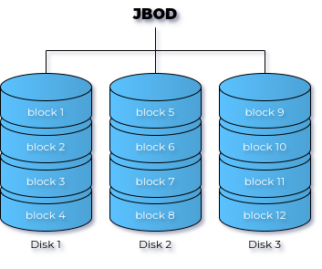
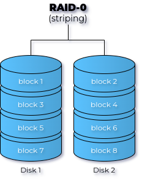
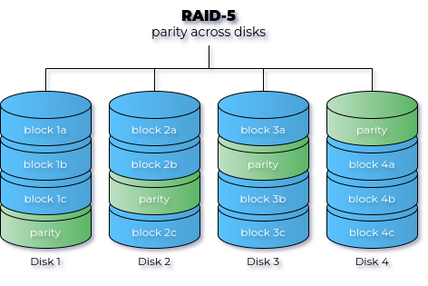

# RAID - Redundant Array of Independent Disks

## JBOD - Just a Bunch of Disks



## RAID 0 - Striping



- Secure against single theft
- Unsecure against hardware failure

## RAID 1 - Mirroring


- Safe against HW failure
- COMPLETELY unsafe against theft
    - Use volume encryption! LUKS, Bitlocker, ...
- Hot spare disk = idle disk, if needed a rebuild action can start automatically

## Parity calculations: XOR

|   A   |   B   |  XOR  |
| :---: | :---: | :---: |
|   0   |   0   |   0   |
|   0   |   1   |   1   |
|   1   |   0   |   1   |
|   1   |   1   |   0   |

## Calculating parity

```text
data1:  0100 1110
data2:  1010 1011
-----------------
parity: 1110 0101
```

Recovering data1 using parity:

```text
data2:  1010 1011
parity: 1110 0101
-----------------
data1:  0100 1110
```

## RAID 5 - Striping with parity



---

- At least 3 disks needed
    - One disk lost for capacity
- Safe against HW failure of one disk
    - One disk fails ⇒ RAID 0-like situation
    - If hot spare is configured, rebuild action starts
    - Warning: increased load on other disks, may trigger other failures
- Current processors make RAID 5 as fast as RAID 1 (or better!)

## Parity with 4 disks

```text
block1a:    0100 1110
block2a:    1010 1011
---------------------
parity-tmp: 1110 0101
block3a:    1101 0011
---------------------
parity:     0011 0110
```

## Recovering block2a using parity

```text
block3a:    1101 0011
parity:     0011 0110
---------------------
parity-tmp: 1110 0101
block1a:    0100 1110
---------------------
block2a:    1010 1011
```

## RAID 10 - Mirroring + striping


- Is RAID 1 (mirroring) combined with RAID 0 (striping)
- At least 4 disks needed
    - Half capacity usable!
- Very frequently used in enterprise environments

## Software vs Hardware RAID

- Difference = where are the calculations done?
    - HW RAID: dedicated RAID chip (controller - onboard or plugin card)
    - SW RAID: CPU
- Directly Attached Storage (DAS): not much use for HW RAID
    - Main CPU is strong enough for added RAID functionality
    - Recovery/forensic analysis is easier with SW RAID
- Network Attached Storage (NAS)/Storage Area Network (SAN): HW RAID
    - Not much choice, often embedded in the device!
    - Dedicated RAID controller with proprietary firmware

## The big problem with HW RAID

- Proprietary firmware
    - In case of data loss: recovery/forensic analysis is difficult/impossible
- Good RAID controller duplicates config on each disk for recovery purposes
    - Not a standard! Depends on implementation
- RAID controllers are *aging*
    - E.g. RAID 10 on Areca RAID controller is not recognized if the disks are connected to an Adaptec RAID controller
    - OR: RAID 10 on a 5 year old Areca RAID is not recognized in recend Areca RAID controller
    - RAID controller has become a single point of failure!

## Software RAID

- Can be done by the OS
    - Linux Software RAID (mdadm), Linux Volume Management (LVM)
    - Windows Dynamic Volumes, Storage Spaces
    - 3rd party software (e.g. Starwind)
- Usually easily expandable
- Recoverable
- Backwards compatible
- "Free" (included in OS)
- Independent of interface (IDE, SATA, SCSI, ...)
- Fast (with modern CPUs)

## Disadvantages of SW RAID

- CPU load
- OS is not easy to install on a RAID volume
- Not all RAID levels are supported
- Hot swap not always supported
