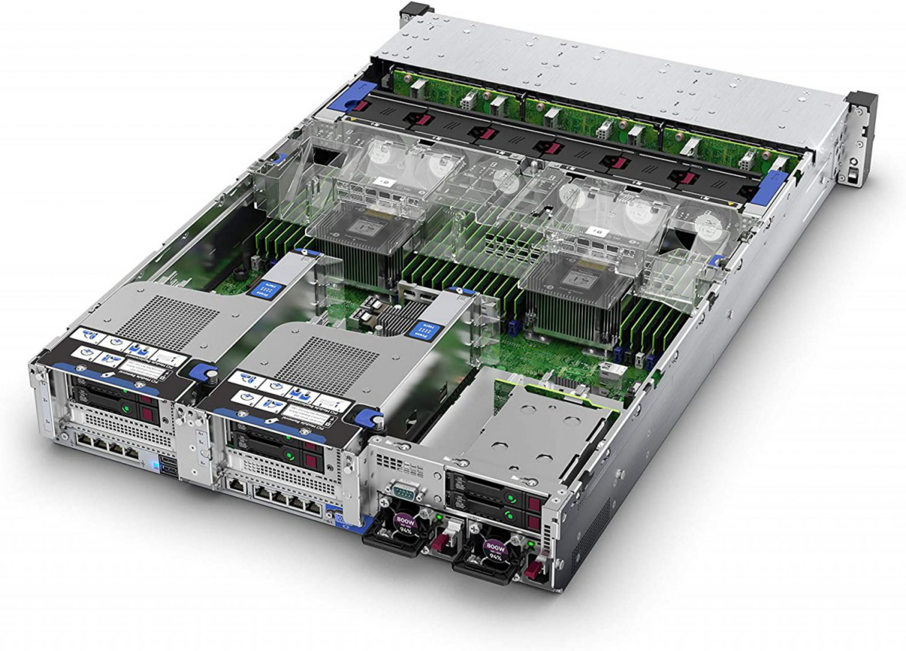
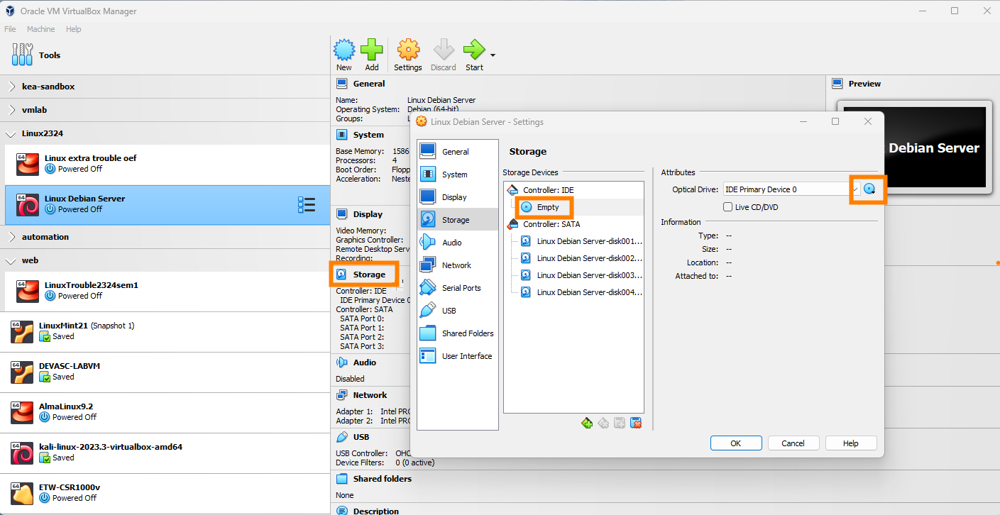

# OS-installatie op servers

## Hoe installeer je hier een OS op?

## Labo-VM representatief voor server-HW

Leerpad 11.4, Downloadknop helemaal onderaan

- 1.5GB RAM
- 2 NICs (NAT, intnet)
- 4HDDs:
    - 1x 8GB (zoals flash-geheugen of SSD op server)
    - 3x 128GB (zoals HDDs op server)

## Debian Netinstall

- Download Debian Netinstall ISO
- Selecteer als "Optical drive" in VM

## Partitioneringsplan

- "sda" is de 8GB schijf
    - `/boot`-partitie
    - swap-partitie
- "sdb", "sdc", "sdd" zijn de 128GB schijven
    - `/` (root-)partitie: RAID-10
    - `/var/www/html`: RAID-5

## Expert installatie

- In GRUB-menu, kies "Advanced options" > "Expert install"
- Volg de instructies in het labo! Leerpad, 11.4
