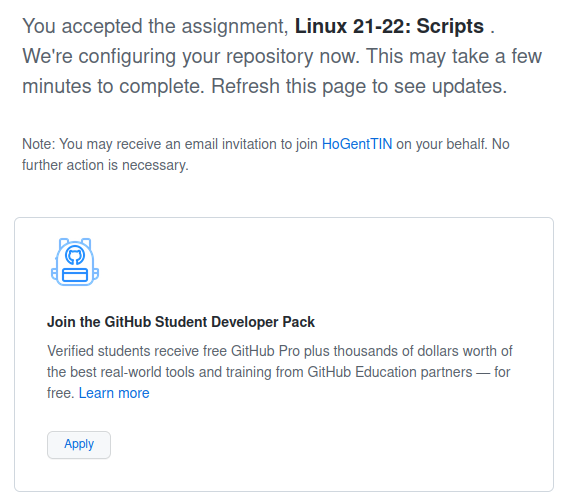
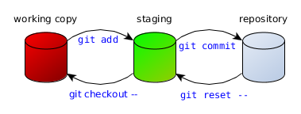
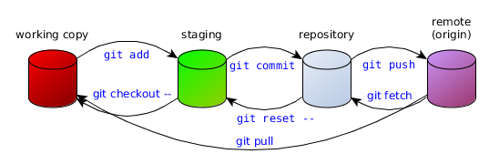

# Git

## Versiebeheer

- = Registreren van veranderingen in code over tijd
    - ook: documentatie, configuratie, ...
    - geschikt voor tekstformaat
- Revisie = toestand v/d code op bepaald moment
    - timestamp
    - auteur
    - commit hash
    - diff t.o.v. vorige revisie

## Git

- Linus Torvalds (2005), Junio Hamano
    - Versiebeheersystemen op dat moment ontoerijkend voor Linux
- Linux kernel development (bv. v5.19)
    - 2.000+ developers
    - netto +804.000 extra lijnen code
    - 16.399 "commits"
    - 12.325 commits staan klaar voor volgende versie

---


## CLI vs GUI

Gebruik Git vanop de command line

(Tenminste, totdat je begrijpt wat je doet...)

## GUI

- Verbergt complexiteit
- Verbergt details
- Beperkt mogelijkheden
- Bemoeilijkt troubleshooting
- **Je begrijpt niet wat je aan het doen bent**

## CLI

- Leercurve, juiste commando's leren gaat niet vanzelf
- Geen beperkingen op mogelijkheden
- Instructies zijn éénduidig en compact
- Makkelijker reproduceerbaar

---


# Opstart, configuratie

## Git client

- Installeer Git op fysiek OS en VM!
- Optioneel: Git UI, bv. Gitkraken

## Basisconfiguratie

Herhaal dit op elk systeem waar je Git gebruikt!

```console
$ git config --global user.name "VOORNAAM NAAM"
$ git config --global user.email "VOORNAAM.NAAM@EXAMPLE.COM"
$ git config --global push.default simple
$ git config --global pull.rebase true
$ git config --global core.autocrlf input
```

---

of

```console
$ git config --global --edit
```

Voorbeeld: <https://github.com/bertvv/dotfiles/blob/main/.gitconfig>

## SSH sleutelpaar genereren

Herhaal dit op elk systeem waar je Git gebruikt!


```console
osboxes@osboxes:~$ ssh-keygen 
Generating public/private rsa key pair.
Enter file in which to save the key (/home/bert/.ssh/id_rsa): 
Created directory '/home/bert/.ssh'.
Enter passphrase (empty for no passphrase): 
Enter same passphrase again: 
Your identification has been saved in /home/bert/.ssh/id_rsa
Your public key has been saved in /home/bert/.ssh/id_rsa.pub
The key fingerprint is:
SHA256:S/WtkPaCSXWK/oqs9lywV6XnMf8nYmYMZ4Io1lx8fS4 bert@osboxes
The key's randomart image is:
+---[RSA 3072]----+
|                 |
|                 |
|       .  o.o    |
|        o+.B...  |
|     o.oSoB =o.  |
|    o +*.*o=E=.  |
|   . .. B .*+..  |
|    .o + . .* ...|
|   ..o= ...+ . .o|
+----[SHA256]-----+
```

## Publieke sleutel kopiëren

- Open `~/.ssh/id_rsa.pub` en kopieer de **volledige** inhoud
- Ga in een browser naar <https://github.com/> en meld aan
- Klik rechtsboven op je avatar, kies "Settings"
- Klik door op "SSH and GPG keys"
- Klik "New SSH key"

---


## Publieke sleutel registreren

Plak in het "Key" veld:


# Opzetten werkomgeving

## Github-repo voor labo-taken aanmaken

Ga naar Chamilo, volg de link om een Github-repo aan te maken.

---


---



---

- Persoonlijke private Github-repository
- Uitnodiging voor Github-organisatie "HogentTIN"
    - <https://github.com/HoGentTIN>

---

<https://github.com/HoGentTIN/linux-2122-scripts-USERNAME>


# Eenvoudige workflow

## Opstart

- Maak repo aan op Github (Classroom)
- Lokale kopie maken met

    `git clone git@github.com:USER/REPO.git`

    - Groene knop "<> Code"
    - Local, SSH, kopieer URL
- Je hebt nu een lokale kopie van de Github-repo:
    - `~/linux-2122-scripts-USERNAME`
    - = directory met subdir `.git`
    - Verplaatsen, naam wijzigen mag!

---

Klik "Code", SSH, Kopieer de URL:


---

```console
osboxes@osboxes:~$ git clone git@github.com:HoGentTIN/linux-2122-scripts-bertvv.git
Cloning into 'linux-2122-scripts-bertvv'...
The authenticity of host 'github.com (140.82.121.4)' can't be established.
RSA key fingerprint is SHA256:nThbg6kXUpJWGl7E1IGOCspRomTxdCARLviKw6E5SY8.
Are you sure you want to continue connecting (yes/no/[fingerprint])? yes
Warning: Permanently added 'github.com,140.82.121.4' (RSA) to the list of known hosts.
remote: Enumerating objects: 28, done.
remote: Counting objects: 100% (28/28), done.
remote: Compressing objects: 100% (25/25), done.
remote: Total 28 (delta 1), reused 27 (delta 1), pack-reused 0
Receiving objects: 100% (28/28), 17.54 KiB | 8.77 MiB/s, done.
Resolving deltas: 100% (1/1), done.
```

## Lokale wijzigingen

Open terminal in directory met lokale kopie

```console
[Bestanden bewerken]
$ git add .
$ git commit -m "Beschrijving aanpassingen"
```

- Dit werkt ook: `git add BESTAND1 BESTAND2 ...`
- `.` = huidige directory (recursief)

---



## Gebruik `git status`!

Na elke stap, bij twijfel

- gewijzigde/toegevoegde bestanden: rood
- bestanden in "staging": groen
- commando voor de volgende stap
- commando om stap ongedaan te maken

## Lokale wijzigingen naar Github

- Eerst eventuele wijzigingen op Github binnenhalen
    - `git pull` of `git pull --rebase`
- Dan lokale wijzigingen naar Github sturen
    - `git push`

---



## Oefening

Maak een bestand `README.md` met deze inhoud:

```markdown
# Linux scripting labo's

- Student: STUDENTNAAM
- Klasgroep: GROEPNAAM
```

Commit, push naar Github, bekijk het resultaat op github.com!

# Conflicten oplossen

## Wat te doen bij conflicten?

```console
$ git push
To github.com:bertvv/git-demo.git
 ! [rejected]        main -> main (fetch first)
error: failed to push some refs to 'git@github.com:bertvv/git-demo.git'
hint: Updates were rejected because the remote contains work that you do
hint: not have locally. This is usually caused by another repository pushing
hint: to the same ref. You may want to first integrate the remote changes
hint: (e.g., 'git pull ...') before pushing again.
hint: See the 'Note about fast-forwards' in 'git push --help' for details.
```

## Stap 1. Rebase

```console
$ git pull --rebase
```

## Stap 2. Status!

```console
$ git status
rebase in progress; onto e5bd2df
You are currently rebasing branch 'main' on 'e5bd2df'.
  (fix conflicts and then run "git rebase --continue")
  (use "git rebase --skip" to skip this patch)
  (use "git rebase --abort" to check out the original branch)

Unmerged paths:
  (use "git reset HEAD <file>..." to unstage)
  (use "git add <file>..." to mark resolution)

	both modified:   README.md

no changes added to commit (use "git add" and/or "git commit -a")
```

## Stap 3. Bewerk bestand(en)

- Zoek naar markeringen
- Sommige editors ondersteunen dit!

```text
If you have questions, please
<<<<<< HEAD
open an issue
======
ask your question in IRC.
>>>>>> branch-a
```

## Stap 4. Mark resolution

```console
$ git add .
$ git status
rebase in progress; onto e5bd2df
You are currently rebasing branch 'main' on 'e5bd2df'.
  (all conflicts fixed: run "git rebase --continue")

Changes to be committed:
  (use "git reset HEAD <file>..." to unstage)

	modified:   README.md
$ git rebase --continue
```

## Stap 5. Push!

```console
$ git status
$ git push
$ git status
```

# Tips & tricks

## Aanbevelingen

- Vaak committen/pushen
- Beschrijvende commit-boodschappen!
- Atomaire commits
- `git status`!
- `.gitignore` - bepaalde bestanden nooit in versiebeheer opnemen

## Aliases

Voeg toe aan `~/.bashrc`

```bash
alias s='git status'
alias a='git add'
alias c='git commit -m'
alias d='git diff'
alias g='git'
alias h='git log --pretty="format:%C(yellow)%h %C(blue)%ad %C(reset)%s%C(red)%d %C(green)%an%C(reset), %C(cyan)%ar" --date=short --graph --all'
alias p='git push && git push --tags'
```

---

```bash
alias gp='git pull --rebase'
alias pr='git pull --rebase'
alias pt='git push -u origin --tags'
# Git author stats
alias gs='git ls-tree -r -z --name-only HEAD | xargs -0 -n1 git blame --line-porcelain | grep  "^author "|sort|uniq -c|sort -nr'
```

Zie: <https://github.com/bertvv/dotfiles/blob/main/.bash.d/aliases.sh>

## Meer info over Git

- Visual Git cheat sheet: <http://ndpsoftware.com/git-cheatsheet.html#loc=stash;>
- Visualizing Git Concepts with D3: <https://onlywei.github.io/explain-git-with-d3/>
    - Let op: verouderde commando's
- Typische fouten rechtzetten: <https://ohshitgit.com/>
- Oefenen: <https://gitexercises.fracz.com>

# Markdown

## Documentatie, nota's bijhouden

- Git(hub) = tekstgebaseerd => niet geschikt voor Word, enz
- Alternatief = Markdown
    - <http://daringfireball.net/projects/markdown/>
    - [Github Markdown manual](https://docs.github.com/en/get-started/writing-on-github/getting-started-with-writing-and-formatting-on-github/basic-writing-and-formatting-syntax)

## Markdown

- Makkelijk te leren
- Op Github automatisch als HTML getoond
- "Fenced code blocks"
    - code met syntaxkleuren
    - copy/paste naar terminal!
- Converteren naar andere formaten

## Markdown in VS Code

- Plugins:
    - Markdown All in One (Yu Zhang)
    - Markdown PDF (yzane)
    - markdownlint (David Anson)
- Features
    - Ctrl+I, Ctrl+B = Italic, bold
    - Ctrl+Shift+V = HTML preview
    - Alt+Shift+F = Format table
    - ...

## Mogelijkheden van Markdown

- HTML (cfr. Github)
- PDF (Pandoc, editor plugin)
- Presentatie (Pandoc, reveal.js)
- Website (Hugo, Jekyll, Mkdocs)
- ...

---


